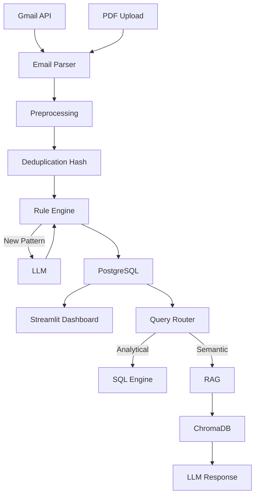

# 💰 Intelligent Expense Tracking & Analytics Platform

An end-to-end **AI-powered personal expense tracking system** that automatically extracts bank transactions from emails and PDFs, categorizes them using LLMs + rule learning, stores them in PostgreSQL, and provides analytics & conversational insights via Streamlit and RAG.

---

## 📌 Problem Statement

Personal expense tracking is fragmented across:
- Bank alert emails
- PDF bank statements
- Manual spreadsheets

This project automates the **entire expense lifecycle**:
from ingestion → cleaning → categorization → storage → analytics → natural language querying.

---

## 🚀 What This Project Does

✔ Extracts transaction data from **HDFC bank emails**  
✔ Supports **password-protected PDF bank statements**  
✔ Uses **LLMs only when required**, then learns rules  
✔ Deduplicates records using **hash-based logic**  
✔ Stores clean data in **PostgreSQL**  
✔ Provides **interactive analytics dashboard (Streamlit)**  
✔ Enables **natural language queries using SQL + RAG**  
✔ Fully **automated via cron jobs**

---

## 🧠 Key Design Philosophy

- **LLM ≠ replacement for SQL**
- **Deterministic logic for analytics**
- **RAG for explanations, not aggregations**
- **Cost-aware and production-oriented AI usage**

---

## 🏗️ System Architecture

---

## 🔄 ETL Pipeline Details

### 1️⃣ Extraction
- Gmail API used to fetch HDFC bank alert emails
- Handles multiple sender patterns:
  - `alerts@hdfcbank.net.in`
  - `alerts@hdfcbank.bank.in`
- PDF upload supported (encrypted & non-encrypted)

### 2️⃣ Transformation
- Regex + NLP-based parsing
- Field extraction:
  - amount, paid_to, txn_date, txn_type, reference_no
- Hash-based deduplication
- Intelligent categorization

### 3️⃣ Loading
- PostgreSQL as the primary datastore
- Idempotent inserts
- Duplicate detection handled safely

---

## 🧠 Categorization Strategy

| Stage | Method |
|-----|------|
| First-time pattern | LLM classification |
| Repeated patterns | Rule-based lookup |
| Storage | `rules.json` |
| Benefit | Faster + cheaper + deterministic |

---

## 📊 Analytics Dashboard (Streamlit)

### Features
- Category-wise spending
- Monthly & daily trends
- Budget vs Actual comparison
- Cumulative expense tracking
- Transaction drill-down
- Interactive filters
- Chat-style assistant for queries

---

## 🤖 Natural Language Query System (Hybrid RAG)

### Query Classification
| Query Type | Example | Execution |
|----------|--------|----------|
| Analytical | "Total petrol expense in January" | SQL |
| Aggregation | "Largest expense category" | SQL |
| Semantic | "Explain my spending habits" | RAG |
| Hybrid | "Why was January expensive?" | SQL + RAG |

### Why Hybrid?
- Embeddings are **bad at numbers & dates**
- SQL is **perfect for aggregations**
- RAG is **great for explanations**

---

## 🛠️ Tech Stack

- **Python**
- **PostgreSQL**
- **Streamlit**
- **Gmail API**
- **Sentence Transformers**
- **ChromaDB**
- **LangChain**
- **LLMs (OpenAI-compatible)**
- **Cron Jobs**

---

## ⏰ Automation & Monitoring

- Daily cron execution
- Centralized logging
- Daily summary extraction
- Error visibility via logs/email
- No silent failures

---

## ⚠️ Limitations

- OAuth token refresh may require re-authentication
- Single-user setup
- No role-based access yet

---

## 🔮 Future Enhancements

- JWT authentication & multi-user support
- Admin UI to correct categories
- Dockerized deployment
- Cloud hosting (AWS / GCP)
- Multi-bank support
- Smarter query planner (SQL + RAG fusion)

---

## 🎯 Why This Project Is Valuable

This project demonstrates:
- Real-world **Data Engineering**
- Practical **GenAI usage**
- Cost-efficient AI design
- End-to-end system thinking
- Production-level automation

It is **not a toy project** — it mirrors how modern fintech data systems are built.

---

## 👤 Author

**Yash Gaikwad**  
Built to showcase expertise in **Data Engineering + GenAI Systems**

